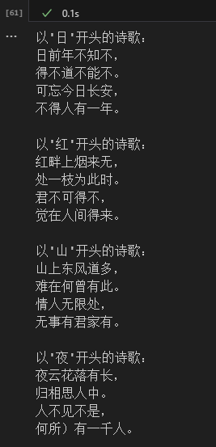

# 
诗歌生成实验报告

2151912 许之仪

## 一、RNN、LSTM、GRU 模型解释

### 1. RNN（循环神经网络）
RNN 是一种处理序列数据的神经网络结构。它通过引入循环结构，使得网络能够利用前一时刻的隐藏状态来影响当前时刻的输出，从而捕捉序列中的时间依赖关系。RNN 的基本单元是 RNN 单元，每个单元的输出不仅取决于当前输入，还取决于前一时刻的隐藏状态。

### 2. LSTM（长短期记忆网络）
LSTM 是 RNN 的一种改进版本，旨在解决 RNN 在处理长序列时容易出现的梯度消失或梯度爆炸问题。LSTM 引入了三个门（遗忘门、输入门和输出门）来控制信息的流动，使得网络能够更好地学习长期依赖关系。遗忘门决定了哪些信息需要遗忘，输入门决定了哪些新信息需要写入，输出门决定了哪些信息需要输出。

### 3. GRU（门控循环单元）
GRU 是 LSTM 的一种简化版本，它将 LSTM 的遗忘门和输入门合并为一个更新门，同时引入了一个重置门。GRU 的结构相对简单，参数更少，但在很多任务中表现与 LSTM 相当。更新门决定了新状态中保留多少旧信息，重置门决定了新状态中包含多少旧状态的信息。

## 二、诗歌生成过程

诗歌生成的过程主要包括以下步骤：

1. **数据预处理**：
   - 从诗歌数据集中提取文本内容。
   - 对文本进行清洗和分词，将每个字符或词语转换为索引。
   - 构建词汇表，将字符或词语映射到唯一的索引。
   - 将文本序列转换为模型可以处理的数值形式。

2. **模型构建**：
   - 选择合适的 RNN 模型（如 LSTM 或 GRU）。
   - 构建模型的嵌入层、RNN 层和全连接层。
   - 定义损失函数和优化器。

3. **模型训练**：
   - 使用诗歌数据集对模型进行训练。
   - 在每个训练周期中，模型会根据输入序列预测下一个字符或词语。
   - 通过反向传播更新模型的参数，以最小化预测误差。

4. **诗歌生成**：
   - 选择一个起始词汇（如“日”、“红”等）作为输入。
   - 模型根据当前输入生成下一个字符或词语。
   - 将生成的字符或词语作为新的输入，继续生成下一个字符或词语，直到生成完整的诗歌。

## 三、生成诗歌

### 生成的诗歌示例

#### 以“日”为开头的诗歌

日前年不知不，
得不道不能不。
可忘今日长安，
不得人有一年。

#### 以“红”为开头的诗歌
红畔上烟来无，
处一枝为此时。
君不可得不，
觉在人间得来。

#### 以'山'开头的诗歌
山上东风道多，
难在何曾有此。
情人无限处，
无事有君家有。

#### 以'夜'开头的诗歌
夜云花落有长，
归相思人中。
人不见不是，
何所）有一千人。

### 生成诗歌的截图

## 四、实验总结

### 实验结果

在本次实验中，我们使用了 TensorFlow 框架构建了一个基于 RNN 的诗歌生成模型。通过训练模型，我们能够生成具有一定文学价值的诗歌。实验结果表明，模型能够较好地捕捉诗歌的韵律和意境。

### 遇到的问题及解决方案

1. **重追溯问题**：
   - **问题**：在训练过程中，`tf.function` 触发了多次重追溯，导致性能下降。
   - **解决方案**：将 `@tf.function` 定义在循环外部，并设置 `reduce_retracing=True`，同时确保输入张量的形状保持一致。

2. **文件编码问题**：
   - **问题**：在读取诗歌数据集时，遇到了 `UnicodeDecodeError`。
   - **解决方案**：在打开文件时显式指定文件编码为 UTF-8。

3. **生成多样性问题**：
   - **问题**：生成的诗歌有时会显得单调。
   - **解决方案**：引入温度参数，调整生成的多样性。同时，尝试使用 Top-k 或 Top-p 采样策略，以避免生成过于单一的结果。

### 改进方向

1. **模型优化**：
   - 尝试使用更复杂的模型结构，如双向 RNN。
   - 调整模型的超参数，如隐藏层大小、学习率等，以进一步提高生成质量。

2. **数据增强**：
   - 增加诗歌数据集的规模和多样性，以丰富模型的词汇量和表达能力。
   - 对数据进行预处理，如去除重复诗歌、纠正错别字等，以提高数据质量。

3. **生成策略改进**：
   - 引入更多的生成策略，如 Beam Search，以提高生成诗歌的质量和多样性。
   - 结合上下文信息，如作者、朝代等，生成更具针对性的诗歌。

### 总结

通过本次实验，我们成功实现了一个基于 RNN 的诗歌生成模型，并对其进行了训练和测试。虽然在实验过程中遇到了一些问题，但通过合理的解决方案，我们克服了这些困难，并取得了一定的实验成果。未来，我们将继续优化模型结构和生成策略，以进一步提高诗歌生成的质量和多样性。